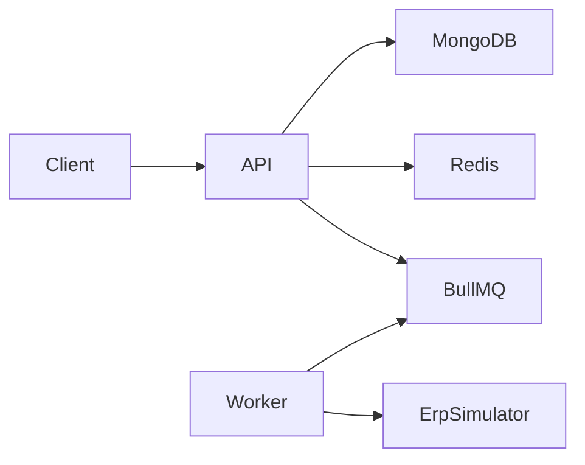

# CaseCellShop — Backend

API Node.js para vitrine e checkout de capinhas, com cache Redis, fila BullMQ e idempotência via `uid`.

## Pré-requisitos

- Node.js 18+
- Docker e Docker Compose

## Instalação e execução

```bash
cd Backend
cp .env.example .env
npm install

# Sobe MongoDB e Redis em containers
npm run docker:up

# Aguarde os containers ficarem healthy (~10s), depois:
npm run seed
npm run dev
```

A API sobe em `http://localhost:3001` (configurável via `PORT`).

### Docker

| Comando | Descrição |
|---------|-----------|
| `npm run docker:up` | Sobe MongoDB (27017) e Redis (6379) |
| `npm run docker:down` | Para e remove os containers |
| `npm run docker:logs` | Acompanha logs dos containers |

Os dados persistem nos volumes `mongodb_data` e `redis_data`. Para limpar tudo:

```bash
docker compose down -v
```

## Variáveis de ambiente

| Variável | Descrição | Padrão |
|----------|-----------|--------|
| `PORT` | Porta da API | `3001` |
| `MONGO_URI` | Conexão MongoDB | `mongodb://localhost:27017/casecellshop` |
| `REDIS_URL` | Conexão Redis | `redis://localhost:6379` |
| `PRODUCTS_CACHE_TTL` | TTL do cache da vitrine (segundos) | `60` |
| `ERP_FAILURE_RATE` | Taxa de falha simulada do ERP (0–1) | `0.25` |
| `ERP_MIN_DELAY_MS` | Delay mínimo do ERP simulado | `2000` |
| `ERP_MAX_DELAY_MS` | Delay máximo do ERP simulado | `4000` |

## Arquitetura

```
index → routes → controllers → services → repositories
                              ↘ schemas (Joi)
```

Componentes adicionais:

- **Redis (`ioredis`)**: cache da listagem de produtos
- **BullMQ**: fila `erp-checkout` com worker assíncrono
- **MongoDB**: produtos, estoque e pedidos



## Endpoints

### `GET /health`
Health check.

### `GET /products`
Lista produtos ativos com estoque. Resposta cacheada no Redis.

### `POST /checkout`

**Body:**
```json
{
  "uid": "3d8f4d7a-91d5-4f67-a3c5-0b6ef4c91234",
  "productId": "507f1f77bcf86cd799439011",
  "amount": 2
}
```

**Respostas:**

| Cenário | Status | errorCode |
|---------|--------|-----------|
| Pedido aceito na fila | `202` | — |
| Payload inválido | `400` | `user_request_error` |
| Estoque insuficiente | `400` | `stock_error` |
| Fila indisponível | `503` | `server_error` |
| Mesmo `uid` (idempotente) | `202` | — |

### `GET /orders/:uid`
Consulta status do pedido (`pending`, `processing`, `completed`, `failed`).

## Decisões técnicas

- **Joi** na pasta `schemas/`, importado no `checkout.service`, para validar entrada antes das regras de negócio.
- **`ioredis`** como cliente Redis — recomendado para BullMQ, que depende dele nativamente.
- **`uid`** como chave de idempotência (`orders.uid` com índice único). Requisições repetidas retornam `202` sem nova reserva.
- **Reserva atômica** via `findOneAndUpdate` com `quantity: { $gte: amount }`.
- **MongoDB** no mini-projeto (em vez de PostgreSQL da Parte 1.A) por simplicidade local; a arquitetura em camadas permanece a mesma.
- **Worker** simula ERP lento/instável; em falha definitiva repõe estoque e marca pedido como `failed`.

## Testes

```bash
npm test
```

- **Unitários**: validação Joi, reserva de estoque
- **Integração**: produtos, checkout, idempotência, concorrência e fila indisponível

Testes usam `mongodb-memory-server` e mocks de Redis/BullMQ — não exigem serviços externos.

## Limitações e próximos passos

- Sem autenticação ou pagamento real
- Sem integração real com ERP (simulador local)
- Reserva de estoque sem expiração automática (TTL de carrinho)
- Frontend React ainda não implementado
- Reconciliação periódica loja ↔ ERP (planejado na Parte 1.A)

## Scripts

| Comando | Descrição |
|---------|-----------|
| `npm run docker:up` | Sobe MongoDB e Redis (Docker) |
| `npm run docker:down` | Para containers Docker |
| `npm run dev` | Desenvolvimento com nodemon |
| `npm start` | Produção |
| `npm run seed` | Popula produtos e estoque |
| `npm test` | Executa testes |
